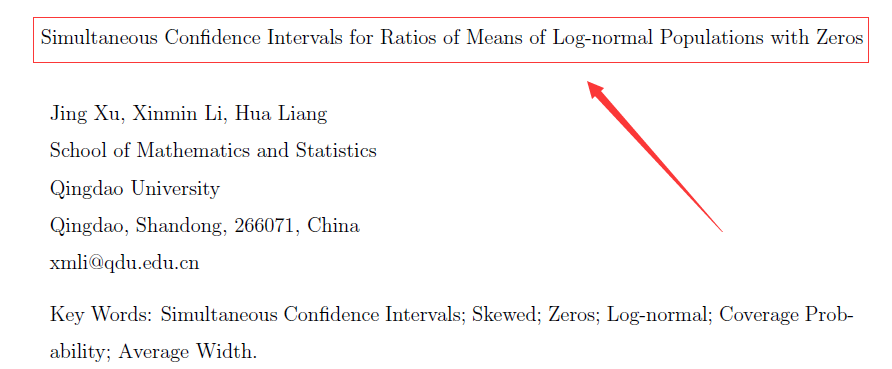

# LN0SCIs3

Jing Xu, Xinmin Li, Hua Liang


## Installation 

`LN0SCIs3` is available through GitHub,
To install the latest development version from GitHub:
```
install.packages("devtools")
devtools::install_github("DataXujing/LN0SCIs3")
```

## Source

`LN0SCIs3` is based on the paper: Simultaneous Confidence Intervals for Ratios of Means of Log-normal Populations with Zeros by Xu et al. Details can refer to the article 



